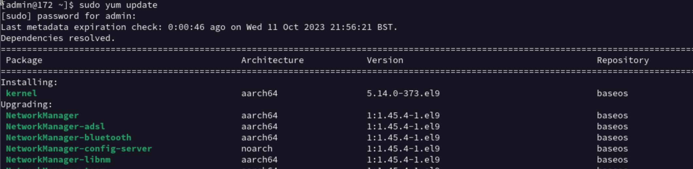

# darey.GitProject1
akeracademy1

- **sudo**
  > Runs commands as a superuser (i.e. root admin)

- **sudo yum update**
> A command using sudo (so it runs as an admin operation) to run updates for the package manager Yum which helps updating the system software

